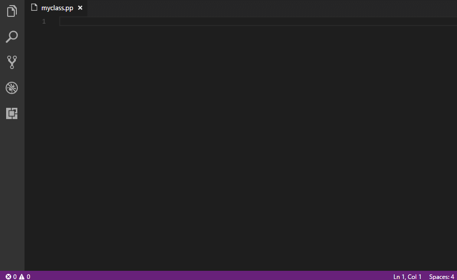

# README

This is an extension for [Visual Studio Code](https://code.visualstudio.com/) providing auto-complete support for documents written in the [Puppet language](https://docs.puppet.com/puppet/4.10/lang_visual_index.html).

It implements the [Language Server Protocol](http://langserver.org/) (LSP), and as such it should be possible to install in other compatible editors - although this might require some adaptation. Popular LSP-compliant editors include Atom and Sublime, and there is a [full list here](http://langserver.org/#implementations-client).

> Note: The VS Code marketplace had extensions providing syntax colouring, snippets, and linting; but nothing providing autocompletion when I began the project. 
>
> It seems however that the guys over at PuppetLabs have been working on this too, almost in parallel. You can check out their new extension [here](https://marketplace.visualstudio.com/items?itemName=jpogran.puppet-vscode).

# Currently supported
* When using resource-style syntax, class and parameter completion are available for built-in Puppet types.
  * In addtion, completion support is available for parameter _values_ of enum types. This could be extended to booleans, and maybe other types too.
  * For custom types, independent parsing of the file containing that type will need to be implemented to provide completion. 
  * Support for in-built resources is hardcoded and thus does not reflect any updates made in later Puppet releases. 
  * Information about the types is scraped from PuppetLabs' website and is thus not totally reliable (_does the information exist in machine-readable format somewhere?_)

# Known limitations
Ideally, these would need to be resolved before tackling any extra features from the TODO list. 
* Comments are not supported :eek:
* Hashes are not supported
* If/Unless blocks are not handled

# Features remaining
* Completion for include-like statements, e.g. "`include filebeat`", "`require nginx`"
* Completion for class pseudo-resource (resource-style class declaration) 
* Completion support for types other than built-in ones.
  * This could include searching a directory for forge modules and custom types
  * Or, it may be given an R10K file and support fetching and parsing modules from here in order to provide completion support.
* Completion for Ruby types (I will probably never do this)
* Argument tips for functions such as `each`, `epp`, `versioncmp`, [and so forth](https://docs.puppet.com/puppet/4.10/function.html)
  * When using a templating function, a nice feature would be to parse the variables out of the template files and present them to the user for auto-completion.
* Providing pop-up documentation for types and parameters, in addition to just their names.
* When declaring a reference to a resource in the format `ResourceType['name']`, autocompletion could provide the appropriate list of resource names (and for the case of `Class['name']`, assistance should be available for the name as well).